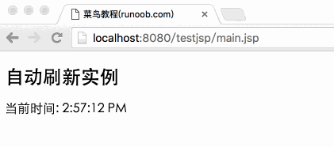

# JSP 服务器响应

Response响应对象主要将JSP容器处理后的结果传回到客户端。可以通过response变量设置HTTP的状态和向客户端发送数据，如Cookie、HTTP文件头信息等。

一个典型的响应看起来就像下面这样：

```
HTTP/1.1 200 OK
Content-Type: text/html
Header2: ...
...
HeaderN: ...
  (空行)
<!doctype ...>
<html>
<head>...</head>
<body>
...
</body>
</html>
```

状态行包含HTTP版本信息，比如HTTP/1.1，一个状态码，比如200，还有一个非常短的信息对应着状态码，比如OK。

下表摘要出了HTTP1.1响应头中最有用的部分，在网络编程中您将会经常见到它们：

| **响应头**             | **描述**                                   |
| ------------------- | ---------------------------------------- |
| Allow               | 指定服务器支持的request方法（GET，POST等等）            |
| Cache-Control       | 指定响应文档能够被安全缓存的情况。通常取值为 **public****，****private** 或**no-cache** 等等。 Public意味着文档可缓存，Private意味着文档只为单用户服务并且只能使用私有缓存。No-cache 意味着文档不被缓存。 |
| Connection          | 命令浏览器是否要使用持久的HTTP连接。**close****值** 命令浏览器不使用持久HTTP连接，而keep-alive 意味着使用持久化连接。 |
| Content-Disposition | 让浏览器要求用户将响应以给定的名称存储在磁盘中                  |
| Content-Encoding    | 指定传输时页面的编码规则                             |
| Content-Language    | 表述文档所使用的语言，比如en， en-us,，ru等等             |
| Content-Length      | 表明响应的字节数。只有在浏览器使用持久化 (keep-alive) HTTP 连接时才有用 |
| Content-Type        | 表明文档使用的MIME类型                            |
| Expires             | 指明啥时候过期并从缓存中移除                           |
| Last-Modified       | 指明文档最后修改时间。客户端可以 缓存文档并且在后续的请求中提供一个 **If-Modified-Since**请求头 |
| Location            | 在300秒内，包含所有的有一个状态码的响应地址，浏览器会自动重连然后检索新文档  |
| Refresh             | 指明浏览器每隔多久请求更新一次页面。                       |
| Retry-After         | 与503 (Service Unavailable)一起使用来告诉用户多久后请求将会得到响应 |
| Set-Cookie          | 指明当前页面对应的cookie                          |

------

## HttpServletResponse类

response 对象是 javax.servlet.http.HttpServletResponse 类的一个实例。就像服务器会创建request对象一样，它也会创建一个客户端响应。

response对象定义了处理创建HTTP信息头的接口。通过使用这个对象，开发者们可以添加新的cookie或时间戳，还有HTTP状态码等等。

下表列出了用来设置HTTP响应头的方法，这些方法由HttpServletResponse 类提供：

| **S.N.** | **方法**** & ****描述**                      |      |
| -------- | ---------------------------------------- | ---- |
| 1        | **String encodeRedirectURL(String url)**| 对sendRedirect()方法使用的URL进行编码      |
| 2        | **String encodeURL(String url)** |将URL编码，回传包含Session ID的URL      |
| 3        | **boolean containsHeader(String name)**返 |回指定的响应头是否存在      |
| 4        | **boolean isCommitted()**  | 返回响应是否已经提交到客户端     |
| 5        | **void addCookie(Cookie cookie)** | 添加指定的cookie至响应中     |
| 6        | **void addDateHeader(String name, long date)** |  添加指定名称的响应头和日期值    |
| 7        | **void addHeader(String name, String value)** | 添加指定名称的响应头和值     |
| 8        | **void addIntHeader(String name, int value)** | 添加指定名称的响应头和int值     |
| 9        | **void flushBuffer()**    | 将任何缓存中的内容写入客户端      |
| 10       | **void reset()** | 清除任何缓存中的任何数据，包括状态码和各种响应头     |
| 11       | **void resetBuffer()** | 清除基本的缓存数据，不包括响应头和状态码     |
| 12       | **void sendError(int sc)** |  使用指定的状态码向客户端发送一个出错响应，然后清除缓存    |
| 13       | **void sendError(int sc, String msg)** | 使用指定的状态码和消息向客户端发送一个出错响应     |
| 14       | **void sendRedirect(String location)** |  使用指定的URL向客户端发送一个临时的间接响应    |
| 15       | **void setBufferSize(int size)** | 设置响应体的缓存区大小     |
| 16       | **void setCharacterEncoding(String charset)** |  指定响应的编码集（MIME字符集），例如UTF-8    |
| 17       | **void setContentLength(int len)** |  指定HTTP servlets中响应的内容的长度，此方法用来设置 HTTP Content-Length 信息头    |
| 18       | **void setContentType(String type)** |  设置响应的内容的类型，如果响应还未被提交的话    |
| 19       | **void setDateHeader(String name, long date)** | 使用指定名称和值设置响应头的名称和内容     |
| 20       | **void setHeader(String name, String value)** |  使用指定名称和值设置响应头的名称和内容    |
| 21       | **void setIntHeader(String name, int value)** |  使用指定名称和值设置响应头的名称和内容    |
| 22       | **void setLocale(Locale loc)**|  设置响应的语言环境，如果响应尚未被提交的话     |
| 23       | **void setStatus(int sc)**     | 设置响应的状态码       |

------

## HTTP响应头程序示例

接下来的例子使用setIntHeader()方法和setRefreshHeader()方法来模拟一个数字时钟：

```java
<%@ page language="java" contentType="text/html; charset=UTF-8"
    pageEncoding="UTF-8"%>
<%@ page import="java.io.*,java.util.*" %>
<!DOCTYPE html>
<html>
<head>
<meta charset="utf-8">
<title>菜鸟教程(runoob.com)</title>
</head>
<body>
<h2>自动刷新实例</h2>
<%
   // 设置每隔5秒自动刷新
   response.setIntHeader("Refresh", 5);
   // 获取当前时间
   Calendar calendar = new GregorianCalendar();
   String am_pm;
   int hour = calendar.get(Calendar.HOUR);
   int minute = calendar.get(Calendar.MINUTE);
   int second = calendar.get(Calendar.SECOND);
   if(calendar.get(Calendar.AM_PM) == 0)
      am_pm = "AM";
   else
      am_pm = "PM";
   String CT = hour+":"+ minute +":"+ second +" "+ am_pm;
   out.println("当前时间: " + CT + "\n");
%>
</body>
</html>
```

将以上代码保存为main.jsp，然后通过浏览器访问它。它将会每隔5秒显示一下系统当前时间。

我们可以看下以下 Gif 演示图：



您也可以自己动手修改以上代码，试试使用其他的方法，将能得到更深的体会。